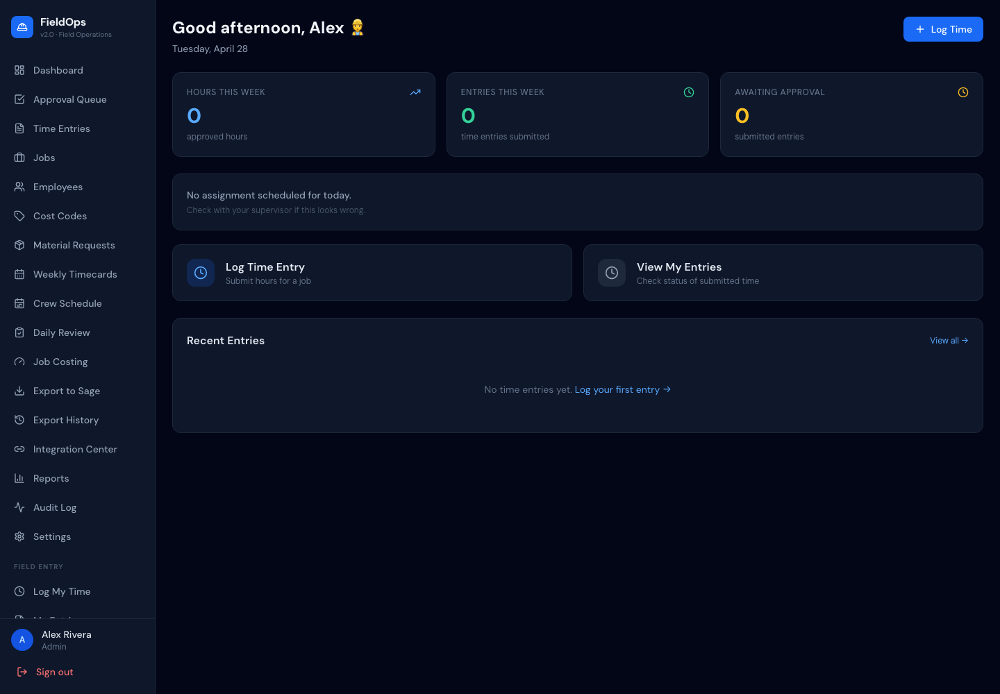
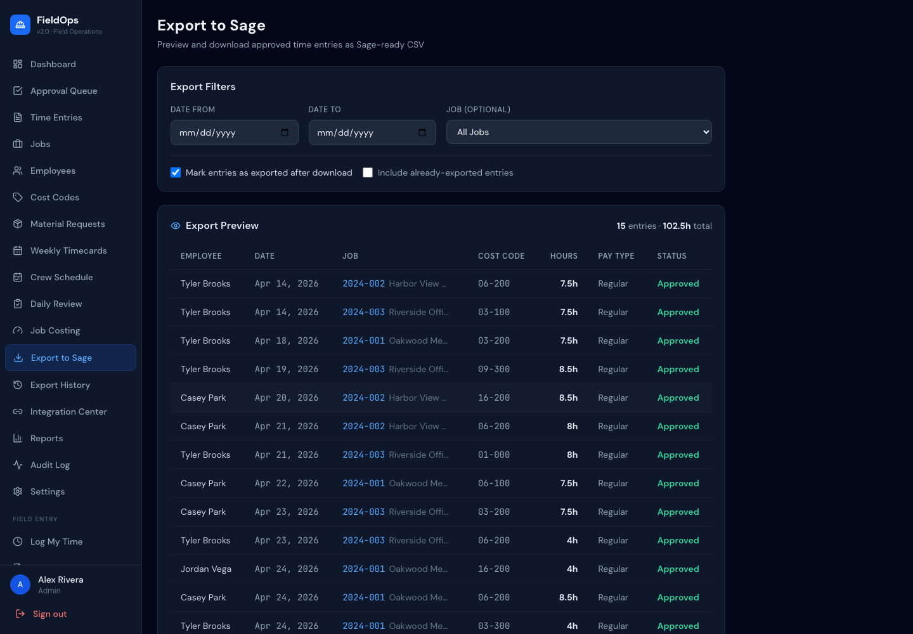

# FieldOps — Field Operations Platform v2.0

A Sage-first contractor operations system covering time tracking, job costing, material requests, supervisor approvals, audit logging, and Sage-ready CSV export.

---

## Quick Start

### Backend
```bash
cd fieldops/backend
python3 -m pip install -r requirements.txt
python3 seed.py
python3 seed_large.py  # optional: adds 35 demo employees for large-crew testing
python3 -m uvicorn main:app --reload --port 8000
```
API: `http://localhost:8000` | Docs: `http://localhost:8000/docs`

### Frontend (new terminal)
```bash
cd fieldops/frontend
npm install
npm run dev
```
App: `http://localhost:3000`

---

## Demo Credentials

| Role | Email | Password |
|---|---|---|
| Admin | admin@fieldops.com | admin123 |
| Supervisor | supervisor@fieldops.com | super123 |
| Worker | worker1@fieldops.com | work123 |
| Worker | worker2@fieldops.com | work123 |
| Worker | worker3@fieldops.com | work123 |

---

## Demo Workflow

1. **Login as worker** → Log time on Oakwood job → Submit
2. **Login as supervisor** → See pending entry in Approval Queue → Edit hours if needed → Approve
3. **Login as worker** → Submit a material request (concrete mix, urgent)
4. **Login as supervisor** → Update material request status to approved
5. **Login as admin** → Export approved entries to Sage CSV → See export in Export History
6. **Login as admin** → View Audit Log to see all actions recorded
7. **Login as admin** → Open Reports → see hours by job, employee, status breakdown

---

## Phase 2 Features

| Feature | Where |
|---|---|
| Audit Trail | Admin → Audit Log |
| Supervisor Edit | Approval Queue → Edit button before approving |
| Material Requests | Left sidebar — all roles |
| Export History | Admin → Export History |
| Admin Settings | Admin → Settings |
| Improved Reports | Reports page — charts + tables |
| **Weekly Timecards** | Admin/Supervisor → Weekly Timecards |
| **Weekly Timecards UX** | Sticky filter bar · search · quick chips · expand/collapse · employee counts |

---

## Project Structure

```
fieldops/
├── README.md
├── CLEANUP_NOTES.md
├── .gitignore
├── backend/
│   ├── main.py              # FastAPI app, all routers
│   ├── database.py          # SQLAlchemy + SQLite
│   ├── models.py            # All DB models (Phase 1 + 2)
│   ├── auth.py              # JWT auth + role guards
│   ├── audit.py             # Shared audit logging helper (Phase 2)
│   ├── seed.py              # Demo data seeder
│   ├── requirements.txt
│   ├── uploads/             # Receipt/photo file storage
│   └── routers/
│       ├── auth.py          # Login, /me
│       ├── users.py         # User management (admin)
│       ├── employees.py     # Employee CRUD
│       ├── jobs.py          # Job CRUD + budget tracking
│       ├── cost_codes.py    # Cost code CRUD
│       ├── time_entries.py  # Time entry CRUD + file upload
│       ├── approvals.py     # Approvals + supervisor edit (Phase 2)
│       ├── export.py        # Sage CSV + export history (Phase 2)
│       ├── reports.py       # Dashboard + job cost + Phase 2 reports
│       ├── material_requests.py  # (Phase 2) Material request workflow
│       ├── audit_logs.py    # (Phase 2) Audit log viewer
│       └── settings.py      # (Phase 2) Company settings
├── frontend/
│   └── src/
│       └── pages/
│           ├── [Phase 1 pages...]
│           ├── MaterialRequestsPage.jsx  # (Phase 2)
│           ├── AuditLogPage.jsx          # (Phase 2)
│           ├── ExportHistoryPage.jsx     # (Phase 2)
│           ├── SettingsPage.jsx          # (Phase 2)
│           └── ReportsPage.jsx           # (Phase 2 - improved)
└── docs/
    ├── SAGE_INTEGRATION_PLAN.md
    └── PHASE_2_ROADMAP.md
```

---

## Database Tables

| Table | Phase | Description |
|---|---|---|
| users | 1 | Auth accounts |
| employees | 1 | Worker/supervisor profiles |
| jobs | 1 | Active and historical jobs |
| cost_codes | 1 | Labor/material cost codes |
| time_entries | 1 | Worker time logs |
| approvals | 1 | Approval decisions |
| receipts | 1 | File upload metadata |
| audit_logs | 2 | Full action history |
| material_requests | 2 | Material request workflow |
| export_batches | 2 | Sage export records |
| company_settings | 2 | Global config |

---

## API Endpoints

### Phase 1
| Method | Path | Auth | Description |
|---|---|---|---|
| POST | `/api/auth/login` | Public | Login |
| GET | `/api/auth/me` | Any | Current user |
| GET/POST | `/api/employees` | Admin | Manage employees |
| GET/POST | `/api/jobs` | Admin | Manage jobs |
| GET/POST | `/api/cost-codes` | Admin | Manage cost codes |
| GET/POST | `/api/time-entries` | Any | Time entries |
| GET | `/api/approvals/queue` | Supervisor+ | Pending approvals |
| POST | `/api/approvals/{id}` | Supervisor+ | Approve/reject |
| POST | `/api/approvals/bulk` | Supervisor+ | Bulk approve |
| GET | `/api/export/sage-csv` | Admin | Download Sage CSV |
| GET | `/api/export/summary` | Admin | Export summary |

### Phase 2
| Method | Path | Auth | Description |
|---|---|---|---|
| PUT | `/api/approvals/{id}/edit` | Supervisor+ | Edit before approving |
| GET | `/api/export/history` | Admin | Past export batches |
| GET/POST | `/api/material-requests` | Any | Material requests |
| PUT | `/api/material-requests/{id}` | Any | Update status |
| GET | `/api/audit-logs` | Supervisor+ | Audit log |
| GET/PUT | `/api/settings` | Admin | Company settings |
| GET | `/api/reports/by-employee` | Supervisor+ | Hours by employee |
| GET | `/api/reports/status-summary` | Supervisor+ | Entry/request status counts |

---

## Uploads

Receipt and photo uploads are stored in `backend/uploads/`. The directory is created automatically.

Uploaded files are served at `http://localhost:8000/uploads/<filename>`.

In production, replace the local filesystem with S3 or a CDN.

---

## Requirements

Python 3.9+, Node.js 18+.

```
fastapi==0.110.0
uvicorn[standard]==0.27.1
sqlalchemy==2.0.30
pydantic==2.7.1
python-jose==3.3.0
passlib==1.7.4
bcrypt==3.2.2
python-multipart==0.0.9
cryptography==42.0.8
```

---

## Sage Integration

See [`docs/SAGE_INTEGRATION_PLAN.md`](docs/SAGE_INTEGRATION_PLAN.md) for the full plan.

**Now (Phase 2):** Export approved entries as Sage-formatted CSV. Export history tracked in DB.
**Phase 3:** Direct Sage API/ODBC sync — pull employees, jobs, cost codes; push time entries and job costs automatically.

---

## Test Checklist

- [ ] Login as admin → all nav links work
- [ ] Login as worker → submit a time entry
- [ ] Login as supervisor → edit an entry → approve it
- [ ] Login as admin → export to Sage (check mark_exported) → view Export History
- [ ] Login as admin → view Audit Log → confirm actions logged
- [ ] Submit a material request as worker → update status as supervisor
- [ ] Admin Settings → save company name → verify saved
- [ ] Reports page → all charts load with data
- [ ] Weekly Timecards → select week, see all employees, navigate prev/next week
- [ ] Weekly Timecards → filter by employee, job, status

## Screenshots

### Admin Dashboard


### Crew Scheduling Board


### Worker Clock In / Clock Out


### Supervisor Daily Review


### Weekly Timecard Review


### Paynet Export Readiness


### Job Costing Dashboard


### Sage Integration Center


