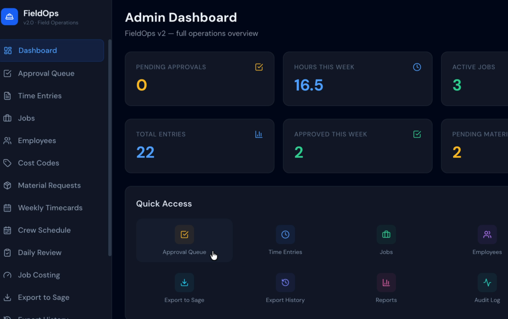

# FieldOps

**FieldOps** is a full-stack construction operations platform for small-to-mid contractors. It connects crew scheduling, worker time tracking, supervisor daily review, weekly payroll approval, job costing, and Sage-ready payroll workflows into one clean system.

FieldOps is designed to help contractors move from field work to clean payroll and job-cost visibility without relying on paper timecards, text messages, spreadsheets, or disconnected tools.

---

## Demo Video

<p align="center">
  <a href="https://youtu.be/mNq2MaEQ_AQ" target="_blank">
    
  </a>
</p>

<p align="center">
  🎥 <strong>Click the image above to watch the FieldOps demo</strong>
</p>


---

## Why FieldOps

Many small-to-mid construction companies use Sage for payroll and accounting, but still collect field time manually. That creates problems every week:

- Foremen text hours at the end of the day
- Payroll admins manually enter time into Sage
- Workers get coded to the wrong job or cost code
- Overtime is discovered too late
- Job-cost reports are only useful after the damage is done
- There is no clean audit trail for approvals, corrections, or payroll changes

FieldOps is designed to close that gap.

---

## Core Workflow

```text
Crew Schedule
    ↓
Worker sees today’s assignment
    ↓
Worker clocks in/out
    ↓
Supervisor reviews daily work
    ↓
Payroll reviews weekly timecards
    ↓
Admin locks payroll
    ↓
Approved locked time is prepared for Sage
    ↓
Owner sees labor cost and job-cost risk
```

---

## Target Users

FieldOps is built for construction companies with roughly **20–250 field workers**, especially:

- Electrical subcontractors
- Plumbing contractors
- HVAC contractors
- Concrete contractors
- Mechanical contractors
- General contractors with self-performing crews
- Sage 100 Contractor or Sage 300 CRE users

---

## Key Features

### Crew Scheduling

- Weekly crew schedule board
- Assign workers to jobs by day
- Planned start and end times
- Supervisor and trade/role filters
- Schedule vs actual variance checks
- Print-ready crew sheets

### Worker Dashboard

- Today’s assignment view
- Clock in / clock out workflow
- Recent time entries
- Correction request workflow
- Mobile-friendly field layout

### Supervisor Daily Review

- Review scheduled crew vs actual time
- Catch missing clock-ins
- Catch wrong-job time entries
- Mark workers absent
- Approve, reject, or request corrections
- Daily sign-off workflow

### Weekly Timecards

- Employee weekly timecard view
- Daily job and cost-code breakdown
- Approve individual entries
- Bulk approve visible entries
- Needs-correction workflow
- Payroll lock and unlock controls

### Sage-Ready Payroll Flow

- Approved and locked time can be prepared for Sage
- Sage sync status tracking
- Export/sync history
- Failed sync retry structure
- Designed for Sage-compatible payroll and job-cost workflows

### Job Costing

- Labor hours by job
- Cost-code breakdown
- Planned vs actual labor
- Overtime risk
- Budget tracking
- Job-cost risk visibility before payroll closes

### Admin Tools

- Jobs
- Employees
- Cost codes
- Material requests
- Reports
- Audit history
- Role-based access control

---

## Tech Stack

### Frontend

- React
- Vite
- JavaScript
- Responsive dashboard UI

### Backend

- FastAPI
- Python
- SQLAlchemy
- SQLite for local development
- JWT authentication
- Role-based permissions

---

## Project Structure

```text
fieldops/
├── backend/
│   ├── main.py
│   ├── models.py
│   ├── database.py
│   ├── auth.py
│   ├── audit.py
│   ├── seed.py
│   ├── seed_large.py
│   └── routers/
│       ├── auth.py
│       ├── jobs.py
│       ├── employees.py
│       ├── cost_codes.py
│       ├── time_entries.py
│       ├── approvals.py
│       ├── schedule.py
│       ├── worker.py
│       ├── daily_review.py
│       ├── reports.py
│       ├── sage.py
│       └── material_requests.py
│
├── frontend/
│   ├── package.json
│   └── src/
│       ├── pages/
│       ├── components/
│       └── utils/
│
├── docs/
│   └── demo/
│       └── fieldops-demo.mov
│
└── README.md
```

---

## Local Setup

### 1. Start the Backend

```bash
cd backend

python3 -m venv .venv
source .venv/bin/activate

pip install -r requirements.txt

python3 seed.py
python3 seed_large.py

python3 -m uvicorn main:app --reload --port 8000
```

Backend API:

```text
http://localhost:8000
```

API docs:

```text
http://localhost:8000/docs
```

---

### 2. Start the Frontend

Open a second terminal:

```bash
cd frontend

npm install
npm run dev
```

Frontend app:

```text
http://localhost:3000
```

---

## Demo Logins

These are local demo credentials only.

| Role | Email | Password |
|---|---|---|
| Admin | admin@fieldops.com | admin123 |
| Supervisor | supervisor@fieldops.com | supervisor123 |
| Worker | worker1@fieldops.com | work123 |

Do not use these credentials in production.

---

## Suggested Demo Flow

1. Log in as admin.
2. Open **Crew Schedule** and assign workers to jobs.
3. Log in as a worker and view today’s assignment.
4. Clock in and clock out.
5. Log in as supervisor and open **Daily Review**.
6. Review submitted time, missing time, and wrong-job flags.
7. Log in as admin and open **Weekly Timecards**.
8. Approve entries and lock payroll.
9. Prepare approved locked time for Sage.
10. Open reports/job costing to review labor risk.

---

## Product Strategy

FieldOps is not trying to replace large enterprise construction platforms. It is focused on a narrower and more practical niche:

> Field-to-payroll operations for Sage-based contractors.

The competitive advantage is the connection between:

- Field scheduling
- Worker time capture
- Supervisor review
- Payroll approval
- Sage-ready sync
- Job-cost visibility

This makes FieldOps useful to foremen, payroll admins, and owners without requiring a full enterprise project management rollout.

---

## Roadmap

### Phase 2.6 — Job Costing Dashboard

- Budget vs actual labor
- Cost-code breakdown
- Overtime risk
- Job-cost snapshots

### Phase 2.7 — Materials and Purchase Requests

- Material request workflow
- Supervisor approval
- Job/cost-code allocation
- Material cost visibility

### Phase 2.8 — Sage Mapping and Integration Center

- Employee mapping
- Job mapping
- Cost-code mapping
- Sage 100 / Sage 300 export configuration
- Sync logs and retry tools

### Phase 2.9 — Admin Company Setup

- Company profile
- User invites
- Employee CSV import
- Payroll week configuration
- Overtime settings
- Sage export format selection

### Phase 3.0 — AI Operations Layer

- Missing time alerts
- Overtime risk alerts
- Wrong-job anomaly detection
- Job-cost risk summaries
- Weekly owner reports

---

## Current Status

FieldOps is an active full-stack MVP. The current version demonstrates the main field-to-payroll workflow locally, including scheduling, time tracking, supervisor review, payroll approval, job costing, and Sage-ready export/sync structure.

---

## Author

Built by **Eli Ortiz** as a full-stack software engineering and product strategy project.
